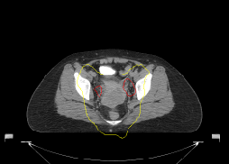

# RT Dose Overlay DICOM Exporter

CT + RTDOSE overlay viewer  
Derived DICOM export  
PACS-compatible grayscale overlay  
Experimental RGB overlay

---

## Installation

1. Install Miniconda  
https://www.anaconda.com/docs/getting-started/miniconda/main

2. Open Anaconda Prompt

3. Navigate to project folder

4. Create environment and install packages

```bash
cd path_to_RT_overlay_viewer
install_env.bat
run_app.bat
```
## Example Output


