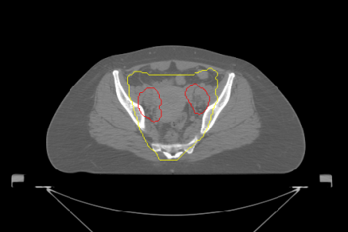
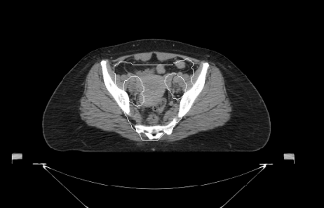

# RT Dose Overlay DICOM Exporter

CT + RTDOSE overlay viewer  

## Export Modes

RGB Color Overlay  
PACS-compatible grayscale overlay  
DICOM Overlay Plane (6000/6002)
Synapse PACs compatible

---

### Installation

1. Install Miniconda  
https://www.anaconda.com/docs/getting-started/miniconda/main

2. Open Anaconda Prompt

3. Navigate to project folder

4. Create environment and install packages

```bash
conda create -n rt_env python=3.11
conda activate rt_env

pip install -r requirements.txt
```
#### Run 
```bash
run_app.bat
```
## Example Output



